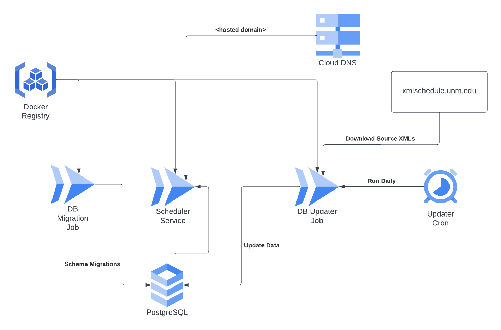

# UnmClassScheduler

This is a personal project to create a personal class schedule planner for UNM classes based on their public XML data.

UNM's public data is hosted here: http://xmlschedule.unm.edu/index.html


## Starting the backend

Download the latest XML source files from http://xmlschedule.unm.edu.
These should be stored in `./xmls/current.xml`, `./xmls/next1.xml`, and `./xmls/next2.xml`.

(There is sometimes a `next3.xml` file available. However, it is usually blank and is not included
as a seed source file.)

The `priv/repo/seeds.exs` file will look for these files locally and attempt to parse them
into the database as starting data.

```bash
# Install dependencies
mix deps.get
# Setup database, perform migrations, and run seeds.exs.
mix ecto.setup

# Start the server
mix phx.server
```

The application will be served from [`localhost:4000`](http://localhost:4000).

## Starting the frontend

The frontend code is also contained in this repository. It can be started as a separate server.

```bash
# Navigate to the frontend
cd ./frontend
# Install dependencies
npm install

# Run frontend
npm run dev
```

This will start the frontend server with hot-reloading on [`localhost:5173`](http://localhost:5173)

To build the frontend for production:
```bash
npm run build
```

This built package can be moved into `./priv/static/webapp` to be served out of the backend server.

## Production Infrastructure
The production infrastructure is intended to run in GCP and is built using Terraform.


